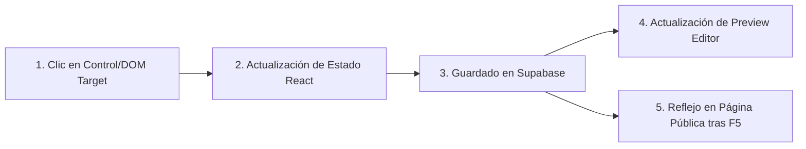

# Template System Master Spec (TEMPLATE-SYSTEM-MASTER-SPEC)

Este documento define la especificación técnica y funcional unificada para el desarrollo, normalización y renderizado de plantillas de perfiles públicos en la plataforma `generador de QR`. Su cumplimiento es obligatorio para todas las plantillas existentes (*Barbara Elite*, *Larissa Luxury*, plantillas básicas) y cualquier futura plantilla.

---

## SPEC-01: Template Identity Contract (Contrato de Identidad Visual)

Cada plantilla define una identidad visual y estética única que la diferencia de las demás, pero esta identidad debe limitarse a aspectos estructurales y de diseño de presentación, sin apropiarse ni sustituir los datos reales del usuario.

### Elementos que una Plantilla SÍ puede fijar:
1. **Composición de Rejilla y Layout**: Ubicación espacial de los bloques (por ejemplo, avatar a la izquierda, cabecera de doble columna, botones en cuadrícula, tarjetas con imágenes a la derecha, etc.).
2. **Estilo Tipográfico y Jerarquía**: Fuentes específicas (Serif de lujo, Sans moderna, Script elegante), tamaños proporcionales de cabeceras, subtítulos y textos, y espaciado de letras (`letter-spacing`).
3. **Efectos y Decoraciones Visuales**: Capas de partículas de fondo, efectos de humo, sombras complejas (`box-shadow`), gradientes fijos de plantilla, monogramas decorativos e iconos de adorno que no representen datos.
4. **Esquema de Spacing y Margen**: Padding de tarjetas, espaciado entre enlaces (`gap`), y márgenes del teléfono/pantalla.

### Elementos que una Plantilla NO debe fijar (Identidad Visual vs Contenido):
* La plantilla no debe predeterminar el texto de presentación del usuario, su nombre, cargo o redes sociales como valores fijos no configurables.
* Si el diseño requiere un adorno tipográfico basado en datos (por ejemplo, un monograma con las iniciales del usuario), este debe generarse dinámicamente usando las iniciales del nombre del perfil real (`profile.display_name`) en lugar de letras estáticas (ej. "LA" o "B").

---

## SPEC-02: User Data Contract (Contrato de Datos de Usuario)

Todos los campos del perfil presentados en el render final deben provenir directamente del modelo `Profile` o de los enlaces asociados en la base de datos. Está estrictamente prohibido el hardcodeo de datos simulados en producción.

### Mapeo de Variables Obligatorio:
1. **Nombre / Título**: Debe renderizarse desde `profile.display_name`.
2. **Profesión / Subtítulo**: No debe ser fijo (como "Beauty Designer" o "Estética Avançada"). Debe provenir de un campo dinámico de perfil (ej. un campo de profesión o subtítulo de perfil si existe, o en su defecto de la primera línea de la biografía o fallback de inicialización limpio).
3. **Biografía / Descripción**: Debe renderizarse desde `profile.bio` utilizando el formateador markdown dinámico (`renderBioText`).
4. **Avatar (Foto de Perfil)**: Debe renderizarse desde `profile.avatar_url`. Si no hay avatar, se debe utilizar un placeholder genérico o avatar de silueta respetando la forma (`avatar_shape`).
5. **Banner (Imagen de Portada)**: Debe renderizarse desde `profile.banner_url`.
6. **Enlaces / Tarjetas de Enlace**: Los enlaces deben mapearse dinámicamente iterando sobre la lista de `links` asociados al perfil que estén habilitados (`link.enabled`).
7. **Redes Sociales (Iconos rápidos)**: Deben extraerse dinámicamente de los enlaces del perfil filtrando por plataformas de redes sociales (ej. Instagram, WhatsApp, TikTok).
8. **Pie de Página (Footer)**: Si `profile.footer_enabled` es `true`, el pie de página debe renderizarse desde `profile.footer_text`.

---

## SPEC-03: Placeholder Contract (Contrato de Contenido de Reemplazo)

Para evitar que un perfil recién creado o incompleto se muestre vacío o roto durante la edición, se define la política de placeholders (marcadores de posición).

1. **Uso en Modo Edición (Preview)**:
   * Si un campo requerido está vacío en el estado del perfil, se debe mostrar un placeholder visible y claramente distinguible en el editor (por ejemplo, usando textos en gris claro como *"[Tu Nombre]"*, *"[Escribe tu biografía aquí]"*, o una silueta de avatar vacía).
2. **Uso en Publicación (Public Page)**:
   * Los placeholders interactivos del editor no deben publicarse en la página pública.
   * Si un campo opcional (como la biografía o el banner) no está configurado por el usuario, simplemente no debe renderizarse en la página pública para evitar mostrar datos simulados o instructivos al visitante final.
3. **Monogramas e Iniciales de Plantillas**:
   * Si el diseño de la plantilla requiere iniciales decorativas (como en *Larissa Luxury*), estas deben derivarse de forma segura del nombre real del perfil:
     ```typescript
     const displayName = profile.display_name || "Tu Nombre";
     const initials = displayName.split(" ").map(n => n[0]).slice(0, 2).join("");
     ```

---

## SPEC-04: Renderer Contract (Contrato del Renderizador)

El componente `PublicProfileView` es el punto de entrada único de renderizado tanto para la previsualización interactiva como para la página pública. Cada plantilla debe comportarse de forma predecible dentro de la jerarquía de React.

### 1. Compatibilidad con `ContextWrapper` e Inicialización de Slots
* En modo previsualización (`isPreview = true`), los elementos interactivos se envuelven en el componente `ContextWrapper` para inyectar barras de herramientas contextuales y detectar clics de edición directa.
* `ContextWrapper` utiliza Radix UI `Slot` (a través de `ContextualToolbar`) para fusionar sus clases y manejadores de eventos.
* **REGLA CRÍTICA**: Todo elemento envuelto en `ContextWrapper` (o cualquier elemento `PopoverTrigger` con `asChild`) debe recibir exactamente un **único elemento hijo válido**. Pasar múltiples hijos o un fragmento React (`<>...</>`) provocará un crash inmediato de React en tiempo de ejecución.
  * *Incorrecto*:
    ```typescript
    <ContextWrapper type="avatar">
      
      <span>Editar</span>
    </ContextWrapper>
    ```
  * *Correcto*:
    ```typescript
    <ContextWrapper type="avatar">
      <div className="relative">
        
        <span>Editar</span>
      </div>
    </ContextWrapper>
    ```

### 2. Separación de Capas Decorativas e Interactivas
* Las capas de efectos estéticos (como partículas `svg`, formas decorativas de fondo o gradientes de humo) deben tener la clase `pointer-events-none` y estar posicionadas de forma absoluta en el fondo (`z-0`).
* Los elementos de contenido (tarjetas de enlaces, fotos de perfil, botones sociales) deben estar en capas superiores (`relative z-10`) y no tener elementos superpuestos que bloqueen las interacciones físicas de clic o tap.

---

## SPEC-05: Editor Target Contract (Contrato de Targets de Edición Contextual)

Para que el sistema de selección y edición contextual del editor de tres paneles funcione correctamente, cada elemento editable del DOM debe tener un atributo `data-editor-target` que lo identifique unívocamente.

| Target Físico | Identificador `data-editor-target` | Panel/Sección Destino en el Editor |
| :--- | :--- | :--- |
| Foto de Perfil | `profile.photo` | Edición de Avatar / Imagen de Perfil |
| Imagen de Portada | `profile.cover` | Edición de Portada / Banner |
| Nombre del Perfil | `profile.name` | Entrada de Nombre |
| Biografía / Descripción | `profile.bio` | Entrada de Biografía / Formato de Texto |
| Enlace de Lista (Fila) | `link:{id}` | Panel de Edición del Enlace específico |
| Redes Sociales Rápidas | `profile.socials` | Configuración de Redes Sociales |
| Pie de Página / Footer | `profile.footer` | Edición de Pie de Página |

### Requisitos de targets:
* Los atributos `data-editor-target` deben estar presentes en el elemento raíz que recibe la interacción en todos los layouts (incluyendo *Barbara Elite* y *Larissa Luxury*).
* Si un layout oculta o no soporta un elemento (por ejemplo, el banner en diseños minimalistas), ese target no debe ser renderizado ni expuesto al DOM.

---

## SPEC-06: Persistence Contract (Contrato de Persistencia)

Cualquier cambio realizado a través de los controles contextuales del editor o del panel lateral debe propagarse correctamente por todo el flujo de estado de la aplicación.



1. **Campos Writable**:
   Cualquier propiedad editable del perfil debe registrarse en la constante `PROFILE_WRITABLE_COLUMNS` dentro de [`profile.service.ts`](file:///C:/Users/Lenovo/Desktop/proyectos desplegados importante/generador de QR/src/services/profile.service.ts) para permitir su persistencia en la base de datos PostgreSQL de Supabase.
2. **Sincronización de Preview e Hilo de Ejecución**:
   El estado intermedio en el editor debe ser reactivo. La vista previa debe reflejar el cambio al instante sin necesidad de guardar explícitamente en base de datos para simular edición en vivo.
3. **Resistencia a Recargas (Refresh)**:
   Al recargar el editor (`F5`), el estado debe recuperarse de la base de datos y renderizar el perfil exactamente igual a como se configuró.

---

## SPEC-07: Responsive Contract (Contrato de Responsividad)

Las plantillas deben adaptarse de forma impecable a múltiples anchos de pantalla sin producir desbordamiento horizontal accidental (`overflow-x`).

### Anchos de Pantalla Objetivo (px):
* **Móviles**: `320`, `360`, `375` (iPhone SE/12), `390`, `412` (Galaxy S20), `430` (iPhone Pro Max).
* **Tablets y Escritorio**: `768`, `1024`, `1280`, `1440`.

### Directrices de Adaptabilidad:
1. **Sin Tamaños Rígidos de Altura**: No fijar alturas fijas (`height`) en contenedores principales de texto o biografía que impidan el crecimiento dinámico del contenido al cambiar de idioma o longitud.
2. **Control de Imágenes y Banners**: Las imágenes de avatar y portada deben usar propiedades como `object-cover` y relacionar tamaños fluidos (o relaciones de aspecto fijas como `aspect-[3/4]` o `aspect-square`) para evitar estiramientos o pixelación.
3. **Distancia de Clic de Seguridad (Pautas de Accesibilidad)**: Todos los enlaces y elementos interactivos envueltos en `ContextWrapper` deben mantener un tamaño de toque mínimo de `44px * 44px` en pantallas móviles para evitar toques accidentales de targets adyacentes.

---

## SPEC-08: Premium Contract (Contrato de Entitlement Premium)

Las plantillas de alta fidelidad como *Barbara Elite* y *Larissa Luxury* son consideradas plantillas Premium. El sistema de plantillas debe separar estrictamente la lógica de visualización de la lógica de autorización.

1. **Separación de Lógica (Decisión de Acceso)**:
   La plantilla en sí no debe decidir si el usuario tiene permiso para usarla. La verificación de suscripción o privilegios debe ser gestionada por el componente contenedor (ej. `MyProfilePage.tsx` o el middleware de rutas).
2. **Comportamiento si se pierde la suscripción (Degradación Elegante)**:
   Si un usuario tiene activa una plantilla premium pero pierde sus privilegios de suscripción (entitlement), el sistema debe degradar el perfil de forma elegante a la plantilla clásica por defecto (`classic_center`), sin corromper sus datos personales ni sus enlaces almacenados.
3. **Edición Restringida**:
   Los datos personales de un usuario en una plantilla premium (como su nombre y biografía) deben seguir siendo editables de la misma manera que en las plantillas gratuitas, garantizando que el usuario tenga control total sobre sus datos independientemente de su nivel de suscripción.

---

## SPEC-09: QA Contract (Contrato de Verificación y Control de Calidad)

Antes de dar por aprobada cualquier modificación de plantillas, se debe seguir y certificar el siguiente flujo de pruebas manuales y automáticas:

1. **QA de Aplicación (APPLY)**: Confirmar que la plantilla se puede aplicar desde el panel de selección de plantillas sin lanzar errores de consola.
2. **QA de Renderizado (RENDER)**: Inspeccionar visualmente que todos los elementos decorativos (partículas, capas de diseño) se muestran correctamente.
3. **QA de Edición Directa (EDIT)**: Seleccionar y editar contextualmente el Avatar, Título y Biografía comprobando que se abren los correspondientes campos en el sidebar.
4. **QA de Guardado (SAVE)**: Pulsar "Guardar", verificar que el payload enviado a Supabase contiene los cambios aplicados y el estado responde con éxito.
5. **QA de Persistencia (REFRESH)**: Recargar la página del editor con F5 y verificar que el diseño se mantiene idéntico.
6. **QA de Visualización Pública (PUBLIC)**: Abrir la ruta pública del perfil en una ventana de incógnito y certificar la paridad exacta del diseño frente a la previsualización del editor.
7. **QA de Responsividad (MOBILE & DESKTOP)**: Probar la plantilla en el emulador de dispositivos del navegador en los anchos `320px`, `375px` y `1024px`, garantizando que no se corta el contenido y el scroll es fluido.
